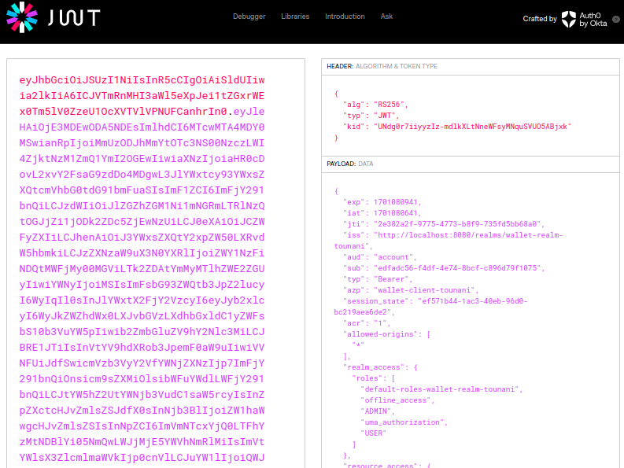

# Activité Pratique N°4 : Sécurité des Systèmes Distribués

## Partie 1 :

### 1. Télécharger Keycloak 19

<a href="https://www.keycloak.org/downloads" >Download </a>

### 2. Démarrer Keycloak

### 3. Créer un compte Admin

### 4. Créer une Realm

### 5. Créer un client à sécuriser

### 6. Créer des utilisateurs

### 7. Créer des rôles

### 8. Affecter les rôles aux utilisateurs

### 9. Avec PostMan :

#### Tester l'authentification avec le mot de passe

#### Analyser les contenus des deux JWT Access Token et Refresh Token

#### Tester l'authentification avec le Refresh Token

#### Tester l'authentification avec Client ID et Client Secret

#### Changer les paramètres des Tokens Access Token et Refresh Token

## Partie 2 :

### Sécuriser avec Keycloak les applications Wallet App

